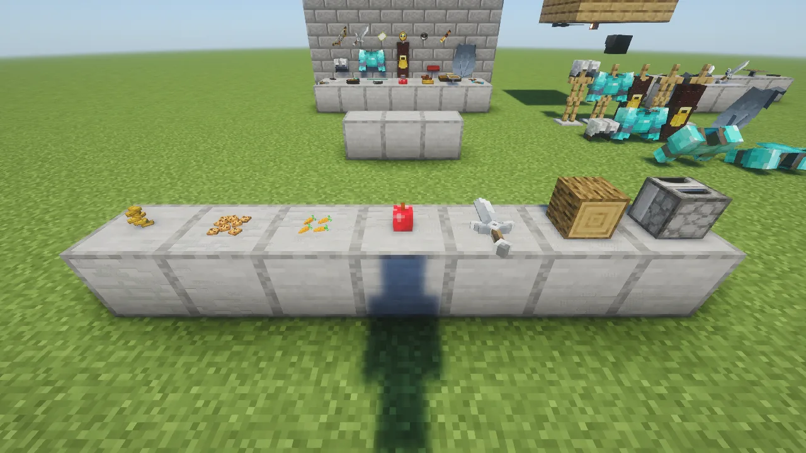

**Set It Down** puts anything you hold down on a block as decoration: a sword on a table, a bow on
a wall, a lantern under a ceiling, a pile of books, a heap of apples, armour standing on the floor
or hung on a wall. It has a key of its own, **Y**, so nothing you already do with a right-click
changes: eating, tilling, Create's wrench and the rest all work as before.

## Setting something down

Look at the top, side or bottom of a block and press **Y**. One of what you hold goes down where
you're looking. It lies flat on floors and tables (its top pointing away from you) and hangs on
walls, as in an item frame but without the frame. If your main hand is empty, it takes from your
off-hand. Anything can be set down: tools, food, blocks, buckets, shields, spawn eggs.

| Do this | What happens |
|---|---|
| **Y** at a block | sets one down there |
| **Y** at something you set down, holding more of it | adds one to the pile |
| **Right-click** it | turns it a little (eight turns make a full circle) |
| **Sneak + right-click** it | tips it up: flat, leaning, on its edge, then flat again |
| **Left-click** it **twice** | takes the top one back into your inventory (or your backpack) |

Things look as they do in your hand: with the pack's resource packs, the 3D apple, bread, carrots
and swords you hold are what you set down, not their flat inventory pictures, and as big as the
pictures were. A 3D thing sits the way it would if you put it down for real: an apple stands, a
cookie or a steak lies flat, a carrot or a sword lies across, corner to corner. Sneak +
right-click tips it.

Things are their own sizes: a sword, a bow or a shield is about a block long, a pickaxe a little
less, a book, a pistol or a block half a block, a compass small, a nugget tiny.

## Piles and heaps

Flat things pile up when you press **Y** at them again: ingots, books, paper, bread, gems, leather,
bricks, discs. Round things heap up instead: apples, potatoes, coal, raw ore, eggs, meat, fish.
Up to four of the same go on one spot. Anything else is one to a spot, and a different item right
next to one is refused ("No room here"). Nothing in a pile or a heap ever pokes through another
one: flat things lie on each other, round ones sit side by side, and a pile of thick 3D things
(loaves, pies) heaps up instead of climbing into a tower.

## Armour

Helmets, chestplates, leggings, boots and elytra are shown as the worn piece, exactly as on an
armour stand in your packs. Armour stands on the floor facing you, hangs on walls and hangs
upright under ceilings. Sneak + right-click tips a floor piece forward onto its face.

## Good to know

- If the block underneath is broken, blown up, pushed by a piston or flooded, everything on it
  drops.
- You can't set things down on water, lava, flowers or torches (nothing to rest on), or in places
  where you can't build.
- Display Delight's plates take food in their middle.
- Arrows and bullets pass straight through things you've set down.

